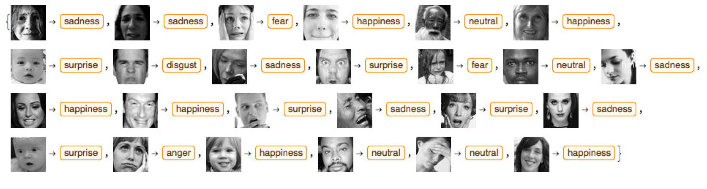

# Intelligent Emotion Detection

The primary objective of this project is to detect underlying human emotions based on a facial image and classify it into one of seven basic human emotions. We used two different methods that rely on CNNs (Convolution Neural Networks): transfer learning using the pre-trained model VGG16 and a CNN model defined and trained from scratch.

We used FER2013 dataset available through Kaggle. The dataset consists of 48x48 pixel grayscale images of faces. The faces have been automatically registered so that the face is more or less centered and occupies about the same amount of space in each image. Our objective is to categorize each image into one of seven emotions (0=Angry, 1=Disgust, 2=Fear, 3=Happy, 4=Sad, 5=Surprise, 6=Neutral).

The code of my individual contribution can be found [here.](Scratch_Model_and_SVM_Transfer.ipynb)
